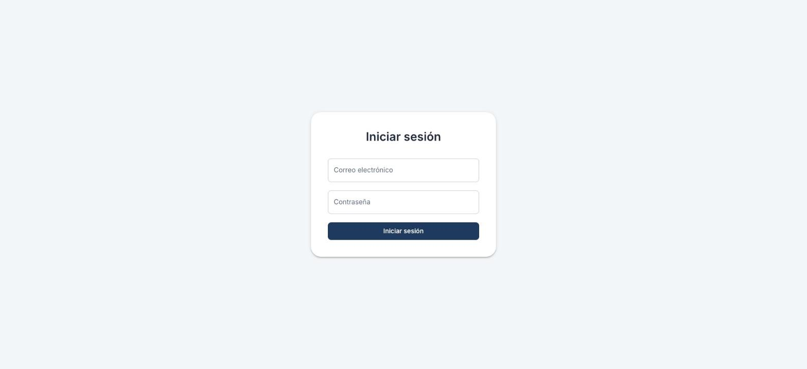
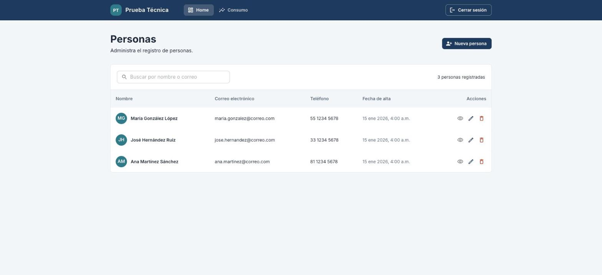
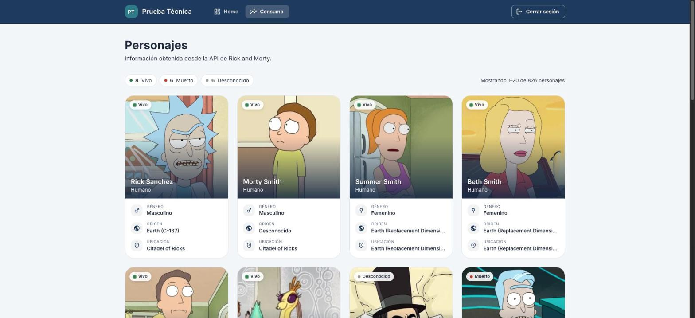

# Administración de Personas

Aplicación web hecha en **React + TypeScript** para la prueba técnica de Desarrollador Frontend.
Permite iniciar sesión (de forma simulada), administrar un registro de personas y consultar una API pública.

Está pensada para verse y sentirse como un producto real: carga rápida, mensajes claros cuando algo falla
y un diseño que funciona igual de bien en el celular que en el escritorio.

| Inicio de sesión | Personas | Consumo de API |
|:---:|:---:|:---:|
|  |  |  |

---

## Contenido

- [Cómo ejecutarlo en 1 minuto](#cómo-ejecutarlo-en-1-minuto)
- [Cómo entrar a la aplicación](#cómo-entrar-a-la-aplicación)
- [Qué puedes hacer](#qué-puedes-hacer)
- [Requisitos del examen y dónde se cumplen](#requisitos-del-examen-y-dónde-se-cumplen)
- [Tecnologías](#tecnologías)
- [Variables de entorno](#variables-de-entorno)
- [Scripts disponibles](#scripts-disponibles)
- [Estructura del proyecto](#estructura-del-proyecto)
- [Decisiones técnicas](#decisiones-técnicas)
- [Limitaciones conocidas](#limitaciones-conocidas)

---

## Cómo ejecutarlo en 1 minuto

### Antes de empezar

Necesitas tener instalado:

- **Node.js 20.19 o superior** (recomendado: la versión LTS más reciente). Puedes revisarlo con `node -v`.
- **pnpm 9 o superior** como gestor de paquetes.

> **¿Por qué pnpm y no npm o yarn?**
> El proyecto guarda las versiones exactas de sus dependencias en `pnpm-lock.yaml`.
> Si instalas con npm o yarn, ese archivo se ignora y podrías terminar con versiones distintas a las probadas.
> Además, `package.json` declara `"packageManager": "pnpm@11.24.0"`, así que pnpm se usa siempre.

¿No tienes pnpm? La forma más sencilla es activarlo con **Corepack**, que ya viene incluido en Node.js:

```bash
corepack enable
```

Corepack lee el campo `packageManager` y usa automáticamente la versión correcta de pnpm.
Si prefieres instalarlo de forma global: `npm install -g pnpm`.

### Pasos

```bash
# 1. Clona el repositorio y entra a la carpeta
git clone https://github.com/JuanDODP/PruebaFront.git
cd PruebaFront

# 2. Instala las dependencias (exactamente las versiones del lockfile)
pnpm install --frozen-lockfile

# 3. Crea tu archivo de configuración a partir del ejemplo
cp .env.example .env

# 4. Levanta el servidor de desarrollo
pnpm dev
```

Abre **http://localhost:5173** en tu navegador y listo.

> En Windows (CMD), el paso 3 es `copy .env.example .env`.
> Si te saltas el paso 3 la app funciona igual, porque usa valores por defecto.

---

## Cómo entrar a la aplicación

El inicio de sesión es **simulado**: no existe un servidor de usuarios.
Escribe **cualquier correo válido** y **cualquier contraseña de 8 caracteres o más**.

```
Correo:      demo@correo.com
Contraseña:  12345678
```

La sesión se recuerda al recargar la página. Para salir, usa **Cerrar sesión** en la parte superior.

---

## Qué puedes hacer

### Personas (pantalla principal)

- **Ver** a todas las personas registradas en una tabla. En el celular la tabla se convierte en tarjetas.
- **Buscar** por nombre o correo. No importan las mayúsculas ni los acentos: "jose" encuentra a "José".
- **Registrar** una persona nueva con un formulario validado.
- **Editar** sus datos. El botón de guardar se activa solo si cambiaste algo.
- **Ver el detalle** al hacer clic en cualquier fila.
- **Eliminar** con una ventana de confirmación, para evitar borrar por accidente.

El formulario valida en tiempo real:

| Campo | Regla |
|---|---|
| Nombre y apellidos | Obligatorios, solo letras, máximo 50 caracteres |
| Correo | Obligatorio, con formato válido y sin repetirse con otra persona |
| Teléfono | Obligatorio, exactamente 10 dígitos. Las letras se descartan al escribir |

Los datos se guardan en el navegador, así que siguen ahí aunque cierres la pestaña.
La primera vez verás 3 personas de ejemplo para que no empieces con la pantalla vacía.

### Consumo (API de Rick and Morty)

- Muestra los personajes de la [API pública de Rick and Morty](https://rickandmortyapi.com/) en tarjetas con
  imagen, nombre, estado, género, origen y ubicación.
- Tiene **paginación** para recorrer los 826 personajes, 20 por página.
- Mientras carga se muestran **siluetas de las tarjetas** (skeletons), en lugar de una pantalla vacía.
- Si la API no responde, aparece un mensaje claro con el botón **Reintentar**.

---

## Requisitos del examen y dónde se cumplen

Esta tabla es para que puedas revisar cada punto sin tener que buscarlo.

| # | Requisito | Dónde verlo |
|---|---|---|
| 1 | Login simulado | `src/pages/LoginPage.tsx`, `src/components/Login/LoginForm.tsx` |
| 2 | Listado en tabla | `src/components/Home/PersonTable.tsx` |
| 3 | Alta de personas | `src/components/Home/PersonFormModal.tsx` |
| 4 | Edición de personas | El mismo modal en modo edición, `src/pages/HomePage.tsx` |
| 5 | Eliminación con confirmación | `src/components/ui/modal/ModalConfirm.tsx` |
| 6 | Búsqueda por nombre o correo | `src/utils/person.ts` → `filterPersons` |
| 7 | Validaciones del formulario | `src/components/Home/personFormFields.ts`, `src/utils/validators.ts` |
| 8 | Vista de detalle | `src/components/Home/PersonDetailModal.tsx` |
| 9 | Componente reutilizable para formularios | `src/components/ui/FormBuilder.tsx` (lo usan el alta y la edición) |
| 10 | Manejo de estado con Hooks | `useReducer`, `useContext` y hooks propios en `src/hooks/` y `src/contexts/` |
| 11 | Consumo de una API REST | `src/services/` (API de Rick and Morty y un servicio simulado de personas) |
| 12 | Estados de carga | Skeletons en Personas y Consumo, botones con indicador de carga |
| 13 | Manejo de errores | Mensajes con "Reintentar", notificaciones y `src/components/ui/ErrorBoundary.tsx` |
| 14 | Diseño responsive | Tabla → tarjetas, modales a pantalla completa en móvil, rejilla de 1 a 4 columnas |

---

## Tecnologías

| Herramienta | Para qué se usa |
|---|---|
| **React 19** + **TypeScript** | Interfaz y tipado de todo el proyecto |
| **Vite** | Servidor de desarrollo y compilación |
| **React Router** | Navegación y rutas protegidas |
| **Material UI (MUI)** | Componentes visuales y tema |
| **React Hook Form** | Manejo y validación de formularios |
| **Axios** | Peticiones HTTP a la API |
| **ESLint** | Revisión de calidad del código |
| **pnpm** | Gestor de dependencias |

---

## Variables de entorno

Se configuran en el archivo `.env`. Puedes copiar `.env.example` como punto de partida.

| Variable | Para qué sirve | Valor por defecto |
|---|---|---|
| `VITE_API_URL` | Dirección de la API de personajes | `https://rickandmortyapi.com/api` |
| `VITE_PERSONS_ERROR_RATE` | Probabilidad de que falle el servicio de personas, de `0` a `1` | `0` (nunca falla) |

### Ver el manejo de errores en acción

El servicio de personas puede fallar a propósito para que veas cómo responde la app.
Pon esto en tu `.env` y **reinicia** `pnpm dev`:

```env
VITE_PERSONS_ERROR_RATE=0.3
```

Con ese valor, cerca de 3 de cada 10 operaciones fallarán. Verás mensajes de error, el botón
**Reintentar** y notificaciones, sin que la app se rompa. Con `1` falla siempre.

---

## Scripts disponibles

| Comando | Qué hace |
|---|---|
| `pnpm dev` | Levanta la app en modo desarrollo en `http://localhost:5173` |
| `pnpm build` | Revisa los tipos de TypeScript y genera la versión de producción en `dist/` |
| `pnpm preview` | Sirve localmente la versión de producción ya compilada |
| `pnpm lint` | Revisa el código con ESLint |

---

## Estructura del proyecto

```
src/
├── api/           Cliente HTTP (Axios) configurado una sola vez
├── components/
│   ├── ui/        Componentes genéricos y reutilizables (botón, formulario, modales, etc.)
│   ├── Home/      Piezas del módulo de personas
│   ├── Consumo/   Piezas del módulo de personajes
│   ├── Layout/    Encabezado y estructura de las páginas
│   └── Login/     Formulario de inicio de sesión
├── config/        Definición de rutas y menú
├── contexts/      Estado global: sesión y personajes
├── data/          Datos de ejemplo iniciales
├── hooks/         Hooks propios (usePersons, useNotification)
├── pages/         Una pantalla por archivo
├── reducers/      Lógica de cómo cambia el estado
├── routes/        Router y protección de rutas
├── services/      Comunicación con APIs (real y simulada)
├── theme/         Colores, tipografía y animaciones
├── types/         Tipos de TypeScript
└── utils/         Funciones de apoyo (validaciones, formatos, errores)
```

Cada carpeta tiene un archivo `index.ts` (*barril*) que reúne lo que exporta.
Así los imports quedan cortos y claros:

```ts
import { Button, Modal } from '@/components/ui'
import { usePersons } from '@/hooks'
```

---

## Decisiones técnicas

Algunas decisiones y por qué las tomé:

- **Capas separadas.** La vista no sabe de dónde vienen los datos: llama a un *hook*, el hook a un *servicio*
  y el servicio a la API. Si mañana existe un backend real para personas, solo cambia
  `src/services/personsService.ts`; los componentes quedan intactos.

- **Una API simulada que se comporta como una real.** El servicio de personas es asíncrono, tiene latencia,
  valida en "el servidor" (por ejemplo, correos duplicados) y puede fallar. Así la carga y los errores se
  manejan igual que se manejarían con un backend de verdad.

- **El estado solo cambia cuando la operación se confirma.** Si guardar falla, la tabla no muestra datos
  falsos y el formulario conserva lo que escribiste para que puedas reintentar.

- **Formularios declarativos.** `FormBuilder` recibe una lista de campos con sus reglas y se encarga del
  diseño, la validación y los botones. Agregar un campo es agregar un objeto a la lista.

- **Carga por partes.** Cada página se descarga solo cuando la visitas (`React.lazy`), así la primera carga
  es más ligera.

- **Peticiones que se cancelan.** Si cambias de página rápido, las peticiones anteriores se cancelan
  (`AbortController`) para que nunca se muestren datos de una página que ya no estás viendo.

- **A prueba de fallos.** Un `ErrorBoundary` evita la pantalla en blanco si algo falla al dibujarse, y las
  rutas que no existen muestran una página 404.

- **Accesibilidad y movimiento.** Los botones con ícono tienen etiquetas para lectores de pantalla, y las
  animaciones se desactivan si el sistema tiene activada la opción de reducir movimiento.

---

## Limitaciones conocidas

Para ser transparente sobre el alcance:

- **El login no es seguro**, a propósito: el examen pide un inicio de sesión simulado, sin autenticación real.
- **Los datos de personas viven en el navegador** (`localStorage`). Si borras los datos del sitio o cambias
  de navegador, empiezas de nuevo con las personas de ejemplo.
- **La carga de personajes tarda al menos 1.5 segundos** a propósito, para que se aprecie el estado de carga.
  Se ajusta en `SIMULATED_LOADING_MS`, dentro de `src/contexts/characters/CharactersProvider.tsx`.

---

Hecho por [JuanDODP](https://github.com/JuanDODP).
